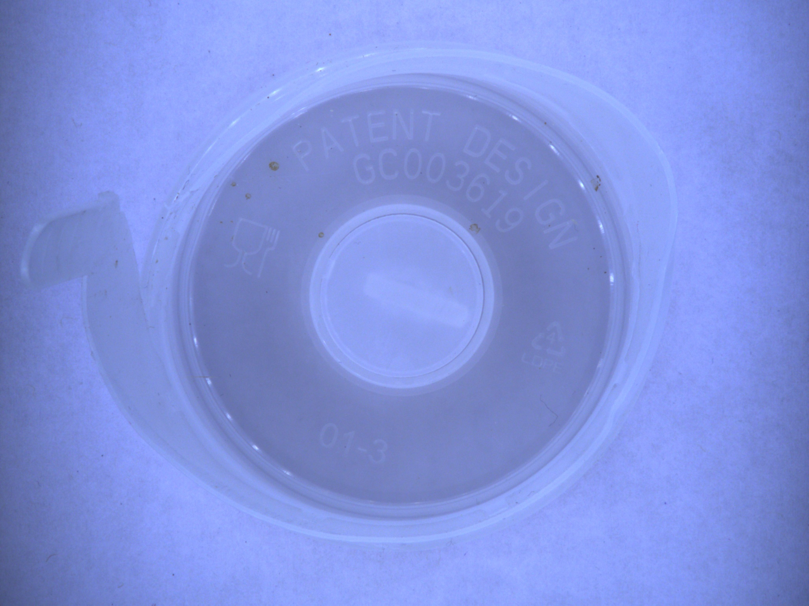
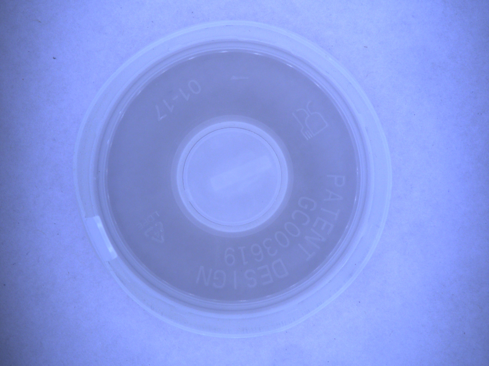
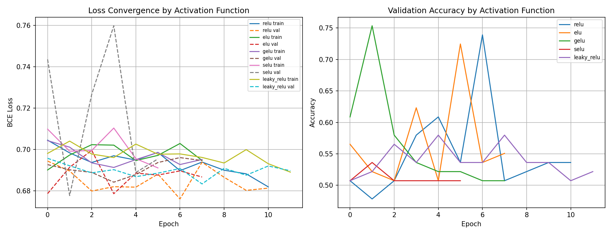
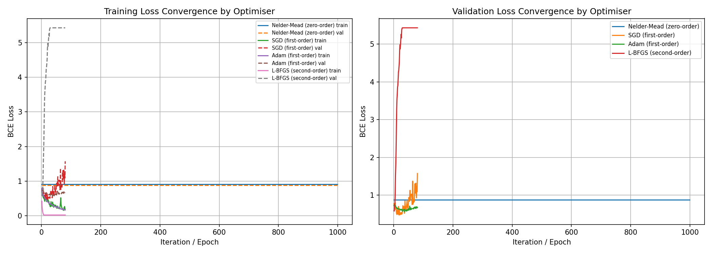
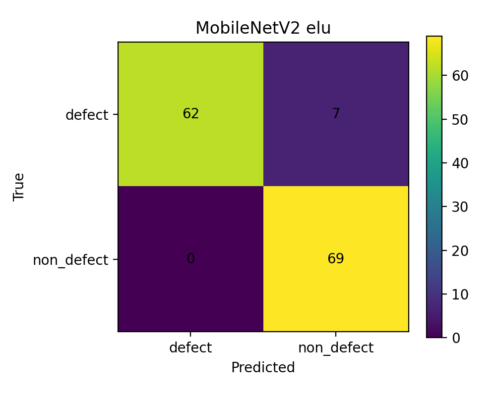
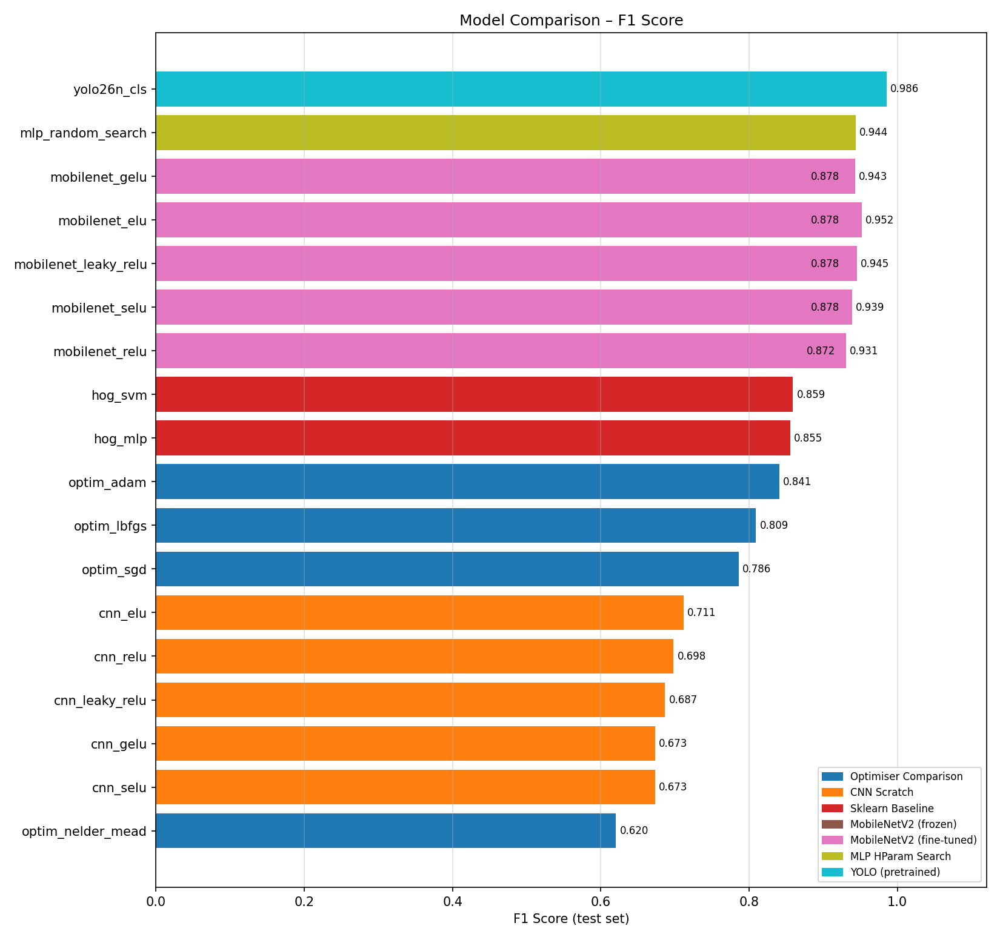
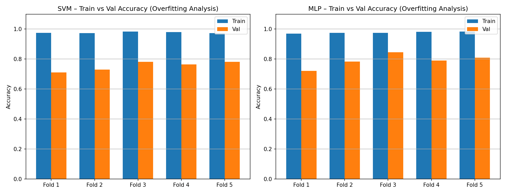

# Claude Work Report

## Section 1: Engineering Problem Definition

This project documents the work completed in `defect_classification_stack` on April 17, 2026 for an ML-based visual quality inspection task. The engineering problem is to inspect cup surfaces from a camera image and output a binary PASS/FAIL decision that could be used in an automated inspection cell.

- Engineering system: fixed-view camera, image preprocessing, classification model, final PASS/FAIL decision
- Input: one RGB image of a cup captured in a controlled inspection area
- Target output: PASS for non-defective cups and FAIL for defective cups
- Ground truth: manual labeling of visible surface condition into defective and non-defective classes

The problem is engineering-relevant because manual inspection is slow, inconsistent, and difficult to scale. A repeatable vision model can support faster rejection of visibly defective parts and create a consistent decision path for production screening. This report keeps the framing practical and cautious: it demonstrates a research-oriented inspection prototype rather than a fully validated factory deployment.

The model strategy was not to assume one architecture in advance. Instead, the work compared interpretable handcrafted-feature baselines, a rubric-aligned scratch CNN, optimiser studies, a tuned MLP, transfer-learning models, and a YOLO classification benchmark. This makes the final recommendation evidence-driven rather than preference-driven.

## Section 2: Dataset Collection and Feature Representation

The workspace shows a cup-inspection dataset built from manually labeled camera images. The current raw folder at `zeroq_cup_classification_scaffold/data/raw` contains 87 defective images and 9 non-defective images. Those raw captures are the starting point, but the experiment results in this report were not all produced from the same downstream processed state. Augmentation, balancing, and later reruns created multiple dataset conditions inside the repository, so the report separates them explicitly.

### 2.1 Dataset states used in the workspace

Two different dataset states exist in the repository, and they should not be treated as the same experiment.

### A. Balanced experiment snapshot used by the coherent `iter1_*`, `iter2_*`, and `iter3_*` runs

This dataset state is evidenced by `defect_classification_stack/runs/data_balanced/dataset_metadata.json` and matches the result files with class names `defect` and `non_defect`.

| Split | Non-defect | Defect | Total |
| --- | ---: | ---: | ---: |
| Train | 241 | 242 | 483 |
| Validation | 35 | 34 | 69 |
| Test | 69 | 69 | 138 |

This balanced snapshot is the authoritative basis for the main research progression in this report because it is the only dataset state that cleanly matches the `iter1_*`, `iter2_mobilenet`, and `iter3_mobilenet_finetune` result families.

### B. Later processed rerun used by `runs/sklearn_baseline`

The current processed dataset under `zeroq_cup_classification_scaffold/data/processed` uses the class names `defective` and `non_defective` and is much more imbalanced.

| Split | Non-defective | Defective | Total |
| --- | ---: | ---: | ---: |
| Train | 248 | 2803 | 3051 |
| Validation | 47 | 597 | 644 |
| Test | 41 | 611 | 652 |

This later dataset state is important because it explains the apparently contradictory `sklearn_baseline` results: high accuracy but zero minority-class precision/recall/F1. Those rerun numbers do not belong in the same pooled comparison as the balanced `iter1_*` baseline results.

### 2.2 Raw and processed dataset locations

- Raw dataset path: `zeroq_cup_classification_scaffold/data/raw`
- Processed dataset path: `zeroq_cup_classification_scaffold/data/processed`
- Main research dataset snapshot evidence: `defect_classification_stack/runs/data_balanced/dataset_metadata.json`

### 2.3 Example PASS/FAIL samples

*Figure 1. Example raw FAIL sample from the defective class.*

*Figure 2. Example raw PASS sample from the non-defective class.*

### 2.4 Feature representation and dimensionality

The codebase uses several feature representations depending on model family.

| Model family | Representation | Dimensionality N | Interpretation |
| --- | --- | ---: | --- |
| Classical HOG baselines | HOG on resized grayscale image | 8100 | Compact handcrafted texture/edge descriptor |
| Optimiser comparison MLP | HOG reduced with PCA | 20 | Very small feature vector used to make zero-order optimisation tractable |
| Scratch CNN / MobileNet | Raw RGB image | 224 x 224 x 3 = 150,528 | High-dimensional input learned directly from pixels |
| YOLO benchmark | Pretrained internal visual features | Internal | Feature extraction handled by pretrained backbone |

The dimensionality matters for both model complexity and overfitting risk. HOG features are much smaller than raw-image tensors, so classical models are easier to train and interpret, but they may miss richer spatial structure. The PCA-reduced 20-dimensional input is intentionally tiny so Nelder-Mead can run on the same MLP architecture, but this also limits representational capacity. Raw-image CNN input is much richer, but it increases optimisation difficulty and overfitting risk when the dataset is small. This is exactly what appears in the results: the scratch CNN underperforms, while transfer learning with pretrained features improves performance substantially.

For the optimiser comparison, the PCA summary in `runs/iter1_optimizer/pca_info.json` shows 20 retained components and about 58.34% total explained variance. That makes the optimiser study computationally feasible, but it is a deliberately compressed representation rather than the highest-information input.

## Section 3: Neural Network Design and Optimisation

This section is best read as a research progression rather than a single final model selected from the start.

### 3.1 Classical HOG baselines on the balanced experiment snapshot

The main classical baselines were produced in `runs/iter1_sklearn`.

| Baseline model | Accuracy | Precision | Recall | F1 |
| --- | ---: | ---: | ---: | ---: |
| HOG + SVM | 0.8478 | 0.8000 | 0.9275 | 0.8591 |
| HOG + sklearn MLP | 0.8406 | 0.7831 | 0.9420 | 0.8553 |

These models provide a useful reference point. They are simpler than the deep models, rely on handcrafted features, and give respectable binary classification performance on the balanced experiment split.

### 3.2 Scratch CNN activation-function sweep

The rubric-required fully connected CNN was implemented in `train_cnn_activation_sweep.py`. The architecture uses:

- input image tensor `224 x 224 x 3`
- three convolutional hidden blocks with channel widths `32 -> 64 -> 128`
- batch normalization, max pooling, and dropout in each block
- dense head `128 -> 128 -> 1`

Five activation functions were compared: ReLU, ELU, GELU, SELU, and LeakyReLU.

| Scratch CNN variant | Accuracy | Precision | Recall | F1 |
| --- | ---: | ---: | ---: | ---: |
| ELU | 0.5942 | 0.5520 | 1.0000 | 0.7113 |
| ReLU | 0.6739 | 0.6500 | 0.7536 | 0.6980 |
| LeakyReLU | 0.5435 | 0.5227 | 1.0000 | 0.6866 |
| GELU | 0.5145 | 0.5074 | 1.0000 | 0.6732 |
| SELU | 0.5145 | 0.5074 | 1.0000 | 0.6732 |

ELU produced the best F1 among the scratch CNN runs, while ReLU produced the best accuracy. Even so, the overall scratch-CNN performance stayed below the stronger classical and transfer-learning models, which suggests that training a CNN from scratch on this scale of data is not the most effective use of model capacity.

*Figure 3. Convergence comparison for the scratch CNN activation sweep.*

### 3.3 Optimiser comparison on the compact MLP

`train_optimizer_comparison.py` compared optimisers from three categories on the same small MLP with the architecture `20 -> 32 -> 16 -> 1`.

- Zero-order: Nelder-Mead
- First-order: SGD and Adam
- Second-order: L-BFGS

| Optimiser | Order | Accuracy | Precision | Recall | F1 |
| --- | --- | ---: | ---: | ---: | ---: |
| Nelder-Mead | Zero-order | 0.4855 | 0.4915 | 0.8406 | 0.6203 |
| SGD | First-order | 0.7826 | 0.7746 | 0.7971 | 0.7857 |
| Adam | First-order | 0.8406 | 0.8406 | 0.8406 | 0.8406 |
| L-BFGS | Second-order | 0.8188 | 0.8548 | 0.7681 | 0.8092 |

Adam gave the strongest overall result in this controlled optimiser study. L-BFGS was competitive and clearly stronger than Nelder-Mead, while the zero-order method struggled on this problem even after dimensionality reduction. This result supports the standard engineering intuition that gradient-based optimisation is more practical than derivative-free optimisation once the network still has a meaningful number of parameters.

*Figure 4. Training convergence across zero-order, first-order, and second-order optimisation methods.*

### 3.4 PyTorch MLP random search

`train_keras_mlp_random_search.py` was repurposed into a PyTorch random-search experiment over hidden sizes, activation, dropout, and learning rate. The best stored hyperparameters were:

- hidden sizes: `(256,)`
- activation: `elu`
- dropout: `0.4`
- learning rate: `0.001`

The best random-search MLP reached:

- accuracy: `0.9420`
- precision: `0.9178`
- recall: `0.9710`
- F1: `0.9437`

This is a strong result because it beats both classical baselines and the scratch CNN without requiring transfer learning. It shows that careful tuning of a simpler network can still produce competitive performance on this task.

### 3.5 Transfer learning with MobileNetV2

`train_cnn_pretrained.py` introduced MobileNetV2 with a custom classification head and repeated the same five-activation comparison in two settings.

#### Frozen backbone

| Frozen MobileNetV2 variant | Accuracy | Precision | Recall | F1 |
| --- | ---: | ---: | ---: | ---: |
| ELU | 0.8696 | 0.8228 | 0.9420 | 0.8784 |
| GELU | 0.8696 | 0.8228 | 0.9420 | 0.8784 |
| SELU | 0.8696 | 0.8228 | 0.9420 | 0.8784 |
| LeakyReLU | 0.8696 | 0.8228 | 0.9420 | 0.8784 |
| ReLU | 0.8623 | 0.8125 | 0.9420 | 0.8725 |

#### Fine-tuned backbone

| Fine-tuned MobileNetV2 variant | Accuracy | Precision | Recall | F1 |
| --- | ---: | ---: | ---: | ---: |
| ELU | 0.9493 | 0.9079 | 1.0000 | 0.9517 |
| LeakyReLU | 0.9420 | 0.8961 | 1.0000 | 0.9452 |
| GELU | 0.9420 | 0.9296 | 0.9565 | 0.9429 |
| SELU | 0.9348 | 0.8846 | 1.0000 | 0.9388 |
| ReLU | 0.9275 | 0.8933 | 0.9710 | 0.9306 |

Fine-tuning clearly improved the transfer-learning model over the frozen setting. The best non-YOLO result in the new stack is `mobilenet_elu`, with 94.93% accuracy and 95.17% F1 on the balanced test set. Its saved classification report shows very strong class balance:

- `defect`: precision `1.0000`, recall `0.8986`, F1 `0.9466`
- `non_defect`: precision `0.9079`, recall `1.0000`, F1 `0.9517`

*Figure 5. Confusion matrix for the strongest fully documented deep model in the new stack.*

### 3.6 YOLO benchmark

`train_yolo26_cls.py` also evaluated a pretrained YOLO26n classification model. The stored summary reports:

- top-1 accuracy: `0.9855`
- top-5 accuracy: `1.0000`
- fitness: `0.9928`

This is the strongest headline result in the available saved artefacts. However, the saved YOLO summary does not include the same full binary precision/recall/F1 report that exists for the other model families. In `runs/final_report/all_results.csv`, the aggregate script mirrors YOLO top-1 into the `f1` column so that it can appear in the same ranking chart. That makes YOLO the strongest headline result, but it should be read as a stored top-1 benchmark rather than a directly equivalent per-class F1 report.

### 3.7 Aggregate ranking

The final aggregate comparison in `runs/final_report/all_results.csv` ranks the best saved experiments as follows:

| Family | Best saved model | Main reported value | Notes |
| --- | --- | --- | --- |
| YOLO benchmark | `yolo26n_cls` | top-1 accuracy `0.9855` | strongest headline result, but not a full saved binary report |
| Fine-tuned transfer learning | `mobilenet_elu` | F1 `0.9517` | best fully documented non-YOLO deep model |
| Tuned MLP | `mlp_random_search` | F1 `0.9437` | strong result without transfer learning |
| Frozen transfer learning | `mobilenet_elu` | F1 `0.8784` | good uplift over scratch CNN |
| Classical baseline | `hog_svm` | F1 `0.8591` | best classical model on balanced snapshot |
| Optimiser study | `optim_adam` | F1 `0.8406` | best optimiser comparison result |
| Scratch CNN | `cnn_elu` | F1 `0.7113` | rubric-aligned CNN but weakest deep approach |

*Figure 6. Consolidated ranking across the main saved model families.*

## Section 4: Baseline Comparison

### 4.1 Main classical baseline comparison aligned with the balanced experiment series

The classical baselines that should be used for direct comparison with the deep models are the `iter1_sklearn` results because they match the balanced `defect/non_defect` experiment family.

| Model | Accuracy | Precision | Recall | F1 | Interpretation |
| --- | ---: | ---: | ---: | ---: | --- |
| HOG + SVM | 0.8478 | 0.8000 | 0.9275 | 0.8591 | strongest classical baseline |
| HOG + sklearn MLP | 0.8406 | 0.7831 | 0.9420 | 0.8553 | comparable but slightly below SVM |

These baselines generalise reasonably well on the balanced test set and create a useful reference for the gains delivered by transfer learning and the tuned MLP.

### 4.2 Later inconsistent rerun in `runs/sklearn_baseline`

The repository also contains a later rerun of the sklearn baselines in `runs/sklearn_baseline`.

| Later rerun model | Accuracy | Precision | Recall | F1 | Why this is misleading alone |
| --- | ---: | ---: | ---: | ---: | --- |
| HOG + SVM | 0.9371 | 0.0000 | 0.0000 | 0.0000 | high accuracy driven by majority class dominance |
| HOG + sklearn MLP | 0.9356 | 0.0000 | 0.0000 | 0.0000 | same issue; minority class is not being recovered |

This inconsistency is explainable from the dataset state, not from the model family itself:

- `iter1_*` uses balanced `defect/non_defect` data with `69 / 69` test support
- `sklearn_baseline` uses `defective/non_defective` data with a heavily imbalanced test set of `611 defective / 41 non_defective`
- the class names also changed between these dataset states
- therefore the rerun should be read as a separate dataset condition rather than a directly comparable baseline refresh

In practical terms, the later rerun shows why accuracy alone is not enough in quality-inspection work. A classifier can look strong on headline accuracy while still failing to recover the minority class correctly.

## Section 5: Experimental Rigor

### 5.1 Train/validation/test split

The main coherent experiment series uses the balanced split recorded in `runs/data_balanced/dataset_metadata.json`:

- train: `241 non_defect / 242 defect`
- validation: `35 non_defect / 34 defect`
- test: `69 non_defect / 69 defect`

This split is the cleanest basis for comparing model families because it prevents the large class imbalance seen in the later rerun from dominating the interpretation.

### 5.2 Cross-validation

`train_cross_validation.py` applied stratified 5-fold cross-validation to pooled train+validation data from the balanced experiment family and then kept the test set held out for final evaluation.

Cross-validation mean results from `runs/iter1_crossval/cv_combined.csv`:

| Model | Mean train accuracy | Mean validation accuracy | Mean validation F1 | Mean overfit gap |
| --- | ---: | ---: | ---: | ---: |
| HOG + SVM CV | 0.9769 | 0.7537 | 0.7804 | 0.2232 |
| HOG + MLP CV | 0.9774 | 0.7900 | 0.8044 | 0.1874 |

These numbers show that both models fit the training folds strongly, but the validation scores drop noticeably, which indicates real overfitting pressure. The MLP baseline generalises slightly more consistently than the SVM in this cross-validation study because it has both higher mean validation accuracy/F1 and a smaller average overfit gap.

*Figure 7. Train-versus-validation performance gap across folds.*

### 5.3 Overfitting analysis

The overfitting evidence appears in three ways:

- the scratch CNN performs much worse than the stronger transfer-learning models, which suggests insufficient data for training a deep model from scratch
- cross-validation gaps remain non-trivial for both classical models
- transfer learning produces a large improvement over the scratch CNN, which is consistent with better prior feature reuse and lower effective data demand

Taken together, the experiments show that model capacity must be matched carefully to dataset scale. The most reliable improvement in this repo comes not from making the scratch network larger, but from using better features and better initialisation.

## Live Demonstration Note

The current April 17 work is mainly model-development and evaluation work. Demonstration support scripts already exist in the older scaffold, especially:

- `zeroq_cup_classification_scaffold/scripts/infer_yolo26_cls.py`
- `zeroq_cup_classification_scaffold/scripts/infer_yolo26_cls_stream.py`

Those scripts are relevant for a future live demo, but the new stack documented here is primarily an experiment and comparison package. A stronger final submission would add direct evidence of the current capture setup, a short scripted demo path on unseen samples, and saved examples of live PASS/FAIL decisions.

## Conclusion

Claude's work in `defect_classification_stack` should be understood as a structured research progression rather than a single isolated model run. The project now contains:

- classical HOG baselines for interpretability
- a rubric-aligned scratch CNN with activation comparisons
- a direct optimiser comparison covering zero-order, first-order, and second-order methods
- a tuned PyTorch MLP
- frozen and fine-tuned MobileNetV2 transfer-learning sweeps
- a YOLO classification benchmark
- a final aggregate ranking across saved results

The main conclusion is:

- strongest overall headline result: `yolo26n_cls` with stored top-1 accuracy `0.9855`
- strongest fully documented non-YOLO model: fine-tuned `mobilenet_elu` with accuracy `0.9493` and F1 `0.9517`
- strongest classical baseline: `hog_svm` with F1 `0.8591`

For a final assessment submission, the best engineering recommendation is to present all of these experiments as a clear research progression and then advocate the best result at the end. If the emphasis is on the single strongest stored headline metric, that is YOLO. If the emphasis is on the strongest non-YOLO model with a fully saved binary classification report, that is fine-tuned MobileNetV2 with ELU.
