# MDX Dubai

**Name:** Bilal Baslar  
**Student ID:** M01099599

## What We Did
- Built a linear regression workflow for travel time prediction using the provided dataset.
- Added feature scaling and cross-validated model selection (Linear, Ridge, Lasso).
- Ran 10 experimental iterations with different parameters and saved metrics + plots.
- Generated per-iteration results in `results/` and summaries in `results/summary.txt`.
- Added a script to create GIFs from predicted-vs-actual plots.

## How to Run

### 1) Set up the environment
```
python -m venv .venv
source .venv/bin/activate
pip install -r requirements.txt
```

### 2) Run a single experiment
```
python travel_experiment.py
```
This writes `results.json` and plots to `plots/` by default.

### 3) Run the 10-iteration batch
```
MPLBACKEND=Agg MPLCONFIGDIR=/tmp/mpl_cache python travel_experiment.py --results batch
```
Outputs are saved under `results/`.

### 4) Create a GIF from plots
```
python make_gif.py --batch-dir results --output results/predicted_vs_actual.gif --width 480 --height 360 --duration 800
```

## Files
- `robo_travel.py`: Main training script with optimized model search.
- `travel_experiment.py`: Reproducible experiments and batch runs with saved outputs.
- `make_gif.py`: Turns predicted-vs-actual plots into a GIF.
- `results/`: Iteration outputs and plots.

## Requirements
See `requirements.txt`.

## Results and Reasons
### Iteration Summary
- iter_01: r2=0.1685, mae=12.9289, mse=215.4511 — Baseline with all predictors and standard 80/20 split.
- iter_02: r2=0.1388, mae=13.1545, mse=223.1439 — Remove `weekend` to reduce redundancy with time-of-day flags.
- iter_03: r2=0.5304, mae=9.8745, mse=121.6824 — Focus on continuous factors + weather; drop time-of-day dummies.
- iter_04: r2=-0.0510, mae=14.2879, mse=272.3172 — Exclude `distance to travel` to test over-reliance.
- iter_05: r2=0.6295, mae=7.7150, mse=82.6104 — Larger test split to check generalization.
- iter_06: r2=0.6094, mae=4.1434, mse=44.6641 — Different random seed to check split sensitivity.
- iter_07: r2=-0.3953, mae=7.1189, mse=83.4905 — Another seed to gauge variability.
- iter_08: r2=0.7543, mae=7.1421, mse=63.6530 — Fewer CV folds to reduce variance with tiny dataset.
- iter_09: r2=0.8285, mae=5.4575, mse=44.4456 — Even fewer folds to test stability.
- iter_10: r2=0.8188, mae=6.6830, mse=79.5971 — Smaller test split to maximize training data.

### Images (from results/)
All iterations:

**iter_01**

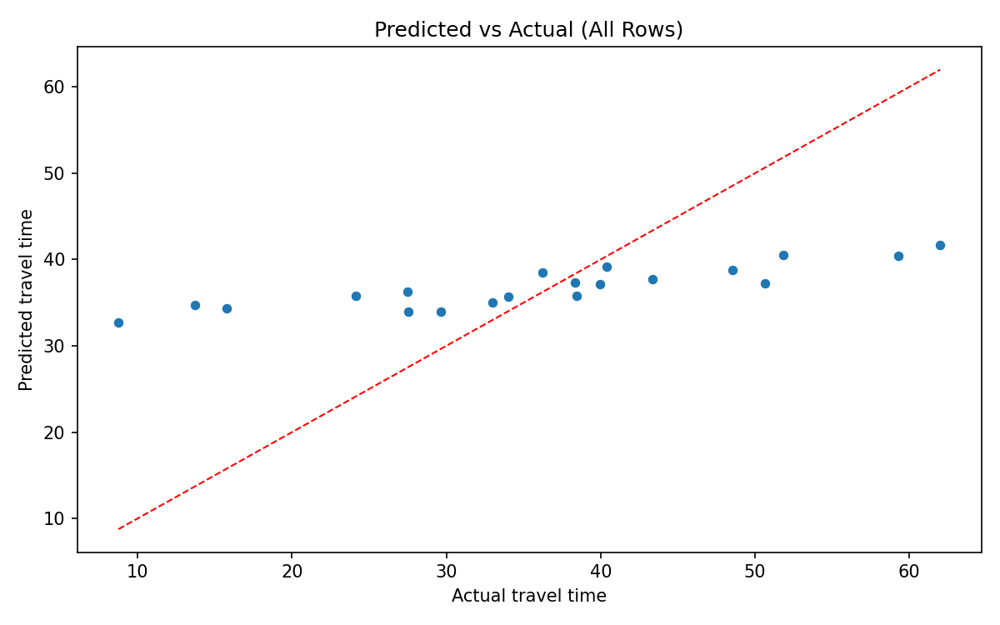

**iter_02**

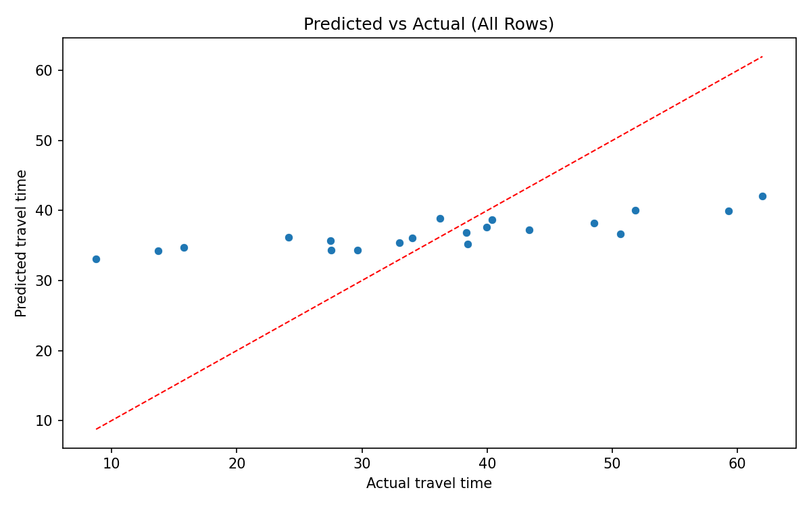

**iter_03**

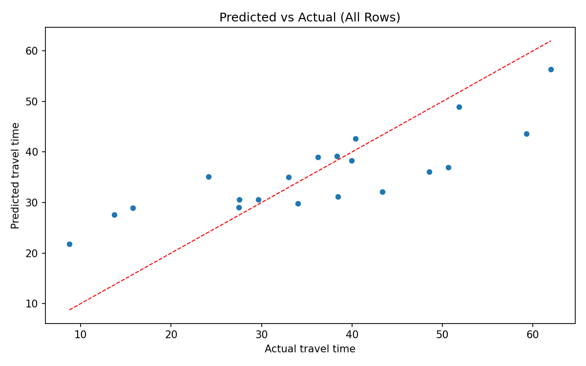

**iter_04**

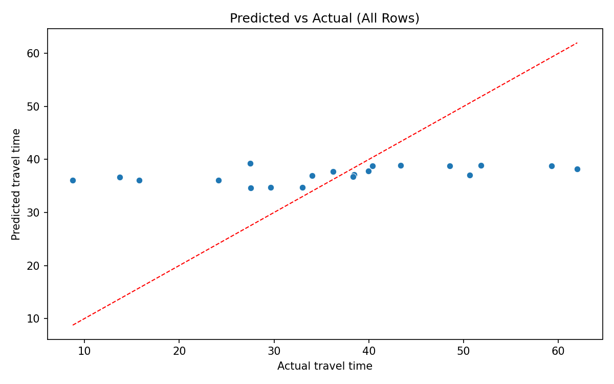

**iter_05**

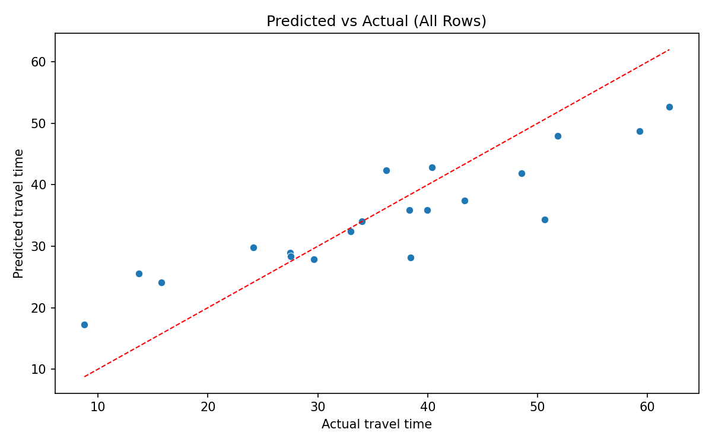

**iter_06**

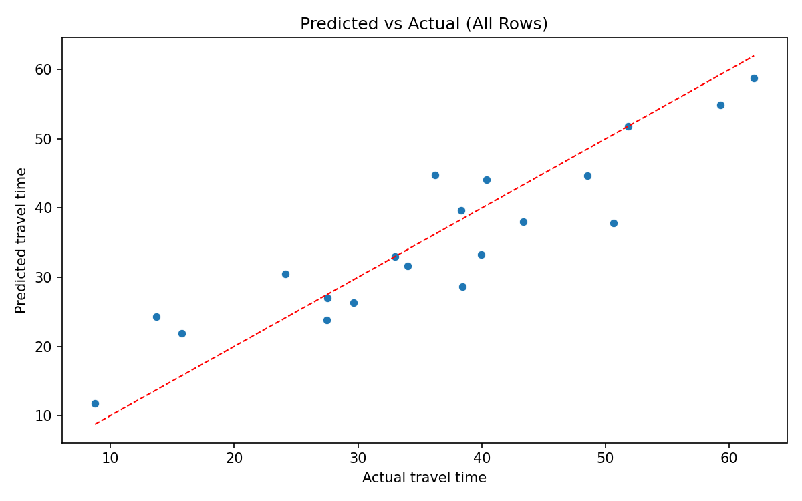

**iter_07**

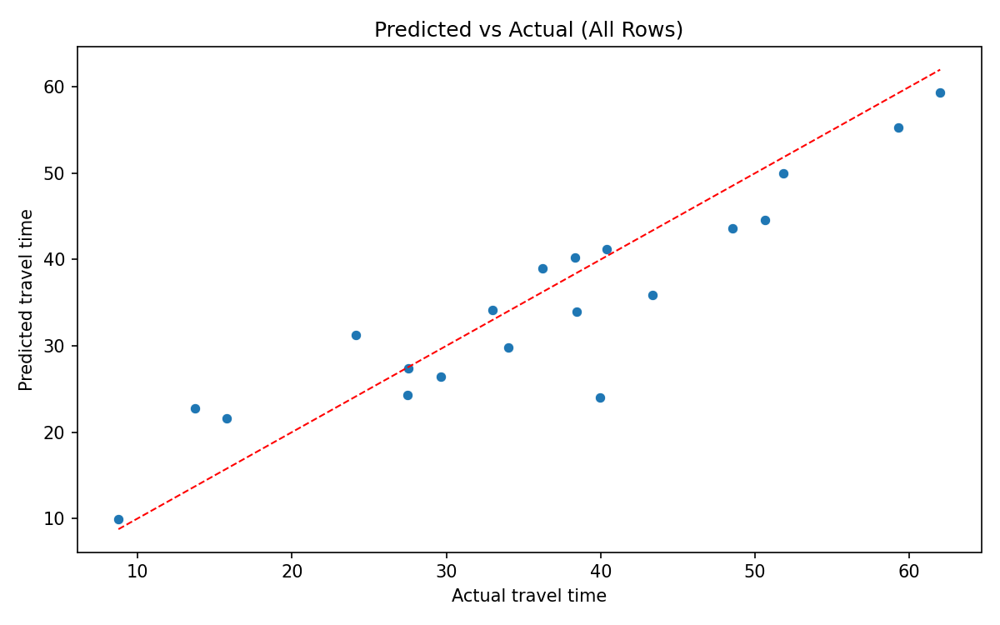

**iter_08**

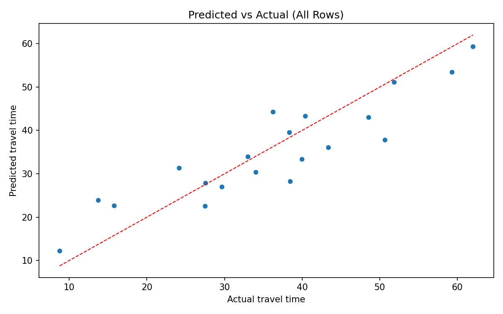

**iter_09**

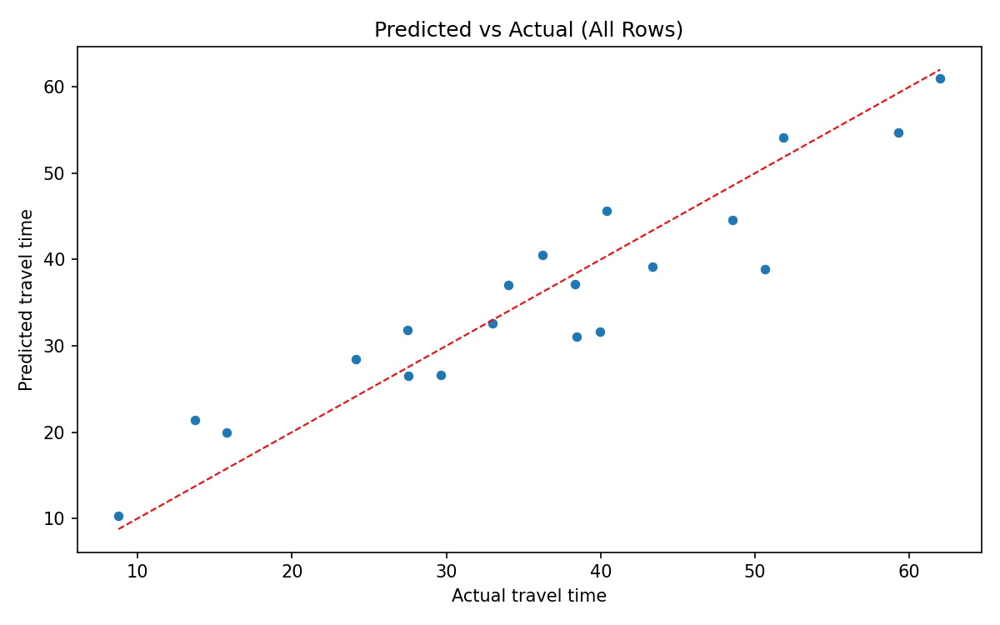

**iter_10**
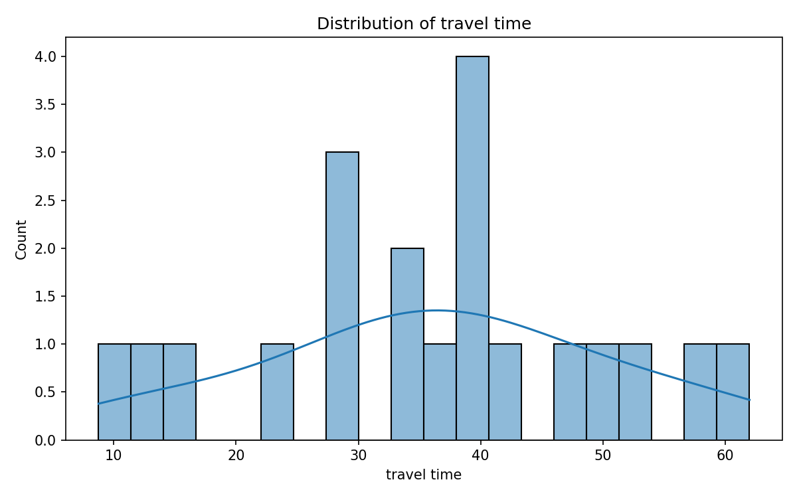
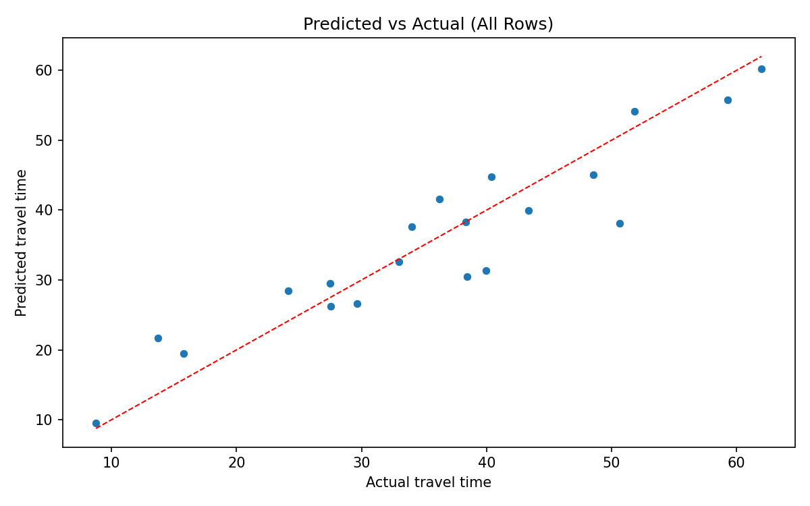

## Final Output
Best-performing configuration was **iter_09** with **R2=0.8285**, **MAE=5.4575**, **MSE=44.4456**. The dataset is very small (20 rows), so metrics can vary with split choice, but iter_09 provides the strongest fit among the tested settings.

## Future Work
- Collect more data (20 rows is very small) to stabilize model performance.
- Add richer features (e.g., traffic level, route type, time-of-week).
- Try non-linear models (RandomForest, GradientBoosting) for improved fit.
- Add proper train/validation/test splits or cross-validated reporting.
- Automate reporting (tables + best-run selection).
